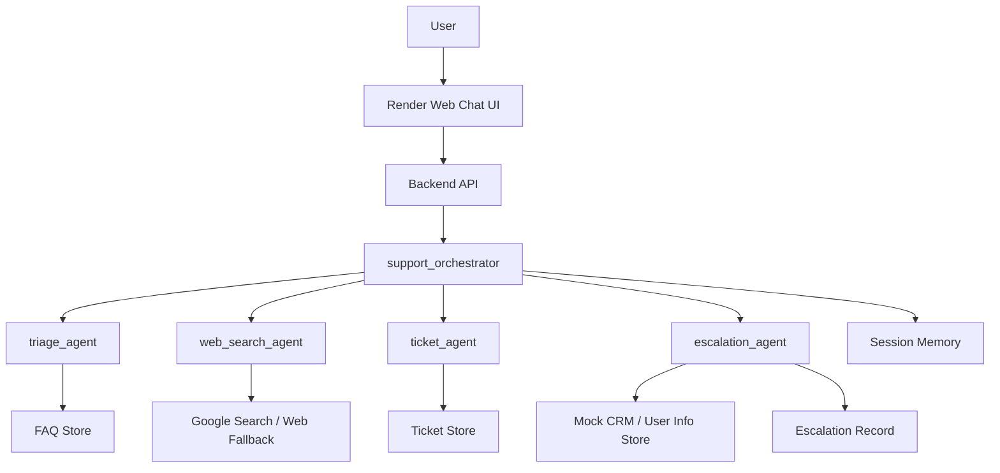

# Usecase 0 Hand-Off: Generic Customer Support Demo

## Purpose
This hand-off document prepares the next implementation session for `usecase-0`: a generic customer support multi-agent demo based on the existing ADK notebook.

Usecase-0 is the baseline demo that proves the shared architecture before adapting it to:

```text
usecase-1: Doctor Appointment Agent
usecase-2: RAG by RABBIT / RABBIT Agent GALA
```

## Current State
Folder:

```text
implementation/usecase-0/
```

Current file:

```text
adk_agentic_ai.ipynb
```

This notebook is identical to the root notebook and currently acts as a learning/reference baseline.

It contains:

```text
triage_agent
web_search_agent
ticket_agent
escalation_agent
support_orchestrator
PreloadMemoryTool
after_agent_callback
SequentialAgent workflow example
priority_classifier example
Vertex AI Agent Engine deployment cells
```

Current limitations:

```text
PROJECT_ID is still "your-project-id"
TICKETS are in-memory only
FAQ is hardcoded in the notebook
JSONPlaceholder is used as fake CRM
no production app structure
no Render-ready web app
no requirements/render.yaml for this usecase folder
no persistent ticket storage
no API endpoint or chat UI yet
```

## Target Outcome
Build a simple generic customer support demo that can be deployed on Render.

The demo should provide:

```text
web chat UI
backend API
FAQ answer tool
web search fallback placeholder or optional integration
ticket create/check/update flow
escalation flow
simple memory/session behavior
persistent local JSON/CSV storage suitable for Render disk limitations
Render deployment config
```

## Product Name
Working name:

```text
Usecase 0 - Generic Customer Support Agent
```

Optional demo title:

```text
Multi-Agent Customer Support Demo
```

## Business Use Case
This demo shows how a multi-agent support system can route customer requests:

```text
FAQ/common question -> triage_agent
unknown answer -> web_search_agent
ticket request -> ticket_agent
urgent/frustrated request -> escalation_agent
```

It is intentionally generic. It should not contain doctor-specific or Rajesh-specific behavior.

## Architecture


## Recommended Implementation Structure
Create a proper app structure under:

```text
implementation/usecase-0/
```

Recommended files:

```text
implementation/usecase-0/
  README.md
  HANDOFF.md
  requirements.txt
  render.yaml
  app.py
  config.py
  .env.example
  data/
    faq.json
    tickets.json
    users.json
    escalations.json
  support_agent/
    __init__.py
    orchestrator.py
    agents.py
    tools.py
    storage.py
    schemas.py
  templates/
    index.html
  static/
    app.js
    styles.css
  tests/
    test_tools.py
    test_storage.py
```

## Implementation Strategy
Do not start with full Vertex AI Agent Engine deployment. For Render, use a normal web app first.

Recommended first deployable path:

```text
Flask or FastAPI backend
simple HTML/JS chat UI
tool functions copied/adapted from notebook
JSON file persistence
basic orchestrator logic
Render web service deployment
```

ADK can be integrated after the simple Render demo works, or the app can preserve ADK-like naming and structure while using deterministic routing for the demo.

## Suggested Phase Plan
### Phase 0.1: Extract Notebook Logic
Move notebook functions into Python modules:

```text
get_faq_answer
create_ticket
check_ticket_status
update_ticket
fetch_user_info
escalate_ticket
```

### Phase 0.2: Add Persistence
Replace in-memory dictionaries with JSON files:

```text
data/faq.json
data/tickets.json
data/users.json
data/escalations.json
```

### Phase 0.3: Add Backend API
Create endpoints:

```text
GET  /
GET  /health
POST /api/chat
POST /api/tickets
GET  /api/tickets/<ticket_id>
```

### Phase 0.4: Add Basic UI
Create a simple chat interface:

```text
message input
chat history
ticket ID display
sample questions
health/status indicator
```

### Phase 0.5: Add Render Deployment
Add:

```text
requirements.txt
render.yaml
.env.example
```

### Phase 0.6: Test And Deploy
Run locally, then deploy to Render.

## Environment Variables
Minimum:

```text
APP_ENV=production
PORT=10000
```

Optional if using LLM/API later:

```text
GOOGLE_API_KEY=
GOOGLE_CLOUD_PROJECT=
GOOGLE_CLOUD_LOCATION=us-central1
MODEL_NAME=gemini-2.5-flash
```

For first Render demo, avoid requiring paid/cloud credentials unless necessary.

## Render Deployment Notes
Recommended Render service:

```text
type: web
runtime: python
buildCommand: pip install -r requirements.txt
startCommand: gunicorn app:app
```

If using Flask:

```text
gunicorn app:app
```

If using FastAPI:

```text
uvicorn app:app --host 0.0.0.0 --port $PORT
```

## Demo Conversations
FAQ:

```text
User: How do I reset my password?
Expected: FAQ answer from password entry.
```

Ticket:

```text
User: Create a ticket for my billing issue.
Expected: Ticket created with ID like TKT-0001.
```

Status:

```text
User: Check TKT-0001.
Expected: Ticket status returned.
```

Escalation:

```text
User: This is urgent. I am very frustrated.
Expected: Ticket created or requested, escalation record created, human follow-up message.
```

Fallback:

```text
User: Something not in FAQ.
Expected: "I could not find this in FAQ" and optional web-search fallback placeholder.
```

## Acceptance Criteria
The implementation is ready for demo when:

```text
Render app opens successfully
/health returns healthy
chat UI works
FAQ questions answer correctly
tickets can be created
ticket status can be checked
tickets can be updated
urgent messages create escalation records
data persists across app requests
README explains local run and Render deploy
```

## Relationship To Usecase 1
Usecase-1 will replace generic support concepts:

```text
ticket_agent -> appointment_agent
FAQ -> clinic FAQ + website embeddings
user store -> name/phone patient lead store
escalation -> registration desk + our doctor/concerned authority
generic disclaimer -> medical disclaimer
```

## Relationship To Usecase 2
Usecase-2 will replace generic support concepts:

```text
ticket_agent -> engagement_agent
ticket -> opportunity/engagement ticket
FAQ -> RABBIT/Rajesh website RAG corpus
escalation -> high-value opportunity routed to Rajesh
support user -> stakeholder/recruiter/client/collaborator
```

## Important Design Rule
Keep usecase-0 generic and simple. Its job is to prove the deployable pattern, not to solve all future requirements.

## Recommended Next Prompt For New Session
```text
We are implementing usecase-0 in:
/Users/jhonny001/Desktop/GenAi Notes/Final_GenAi/Ai Agents/GCP/gcp_multi_agent_adk_agentic/implementation/usecase-0

Read HANDOFF.md and adk_agentic_ai.ipynb. Build a Render-deployable generic customer support demo using the notebook logic. Create a Flask app with chat UI, persistent JSON storage for FAQ/tickets/users/escalations, /health and /api/chat endpoints, requirements.txt, render.yaml, README.md, and basic tests. Keep it generic because this is the baseline for usecase-1 and usecase-2.
```
