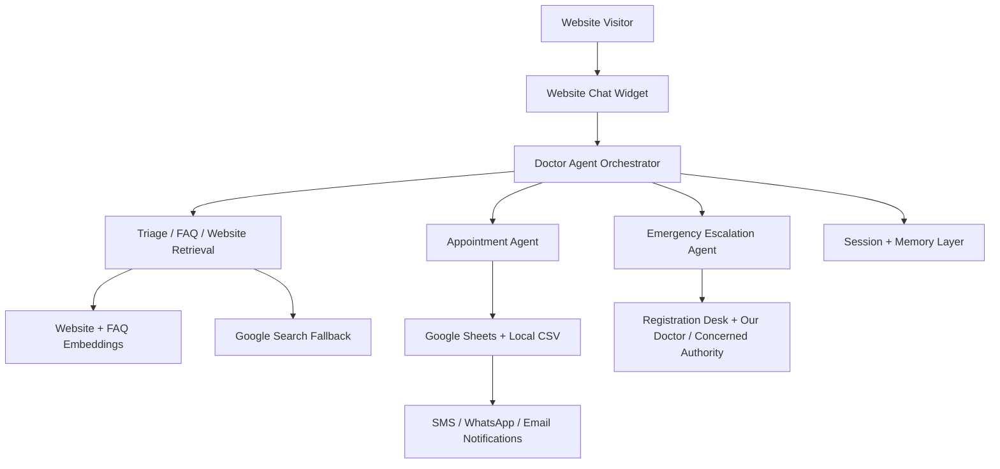

# Usecase 1 Phase Roadmap

## Purpose
This folder documents the phased build plan for the Doctor Appointment Agent. Each phase is designed to deliver business value while controlling medical risk, patient experience, technical complexity, and long-term cost.

## Approved Phase Structure
```text
Phase 1: Text-First Website Q&A + Lead Capture
Phase 2: Appointment Request Workflow
Phase 3: Emergency Escalation + Human Handoff
Phase 4: Memory + Returning User Continuity
Phase 5: Advanced Multilingual + Audio
Phase 6: Automation + Analytics + Cost Governance
Phase 7: Production Hardening + Future Database
```

## Overall Architecture Direction


## Phase Philosophy
The first three phases create the launch-ready business path:

```text
answer questions -> capture leads -> request appointments -> escalate urgent concerns
```

The next four phases mature the system:

```text
remember returning users -> expand language/audio access -> measure ROI -> harden for production scale
```

## Documentation Rule
Each phase document includes:

```text
business goal
stakeholders
patient/user experience
medical safety
workflow
tools
data/artifacts
economics
risks
exit criteria
architecture visual
```
