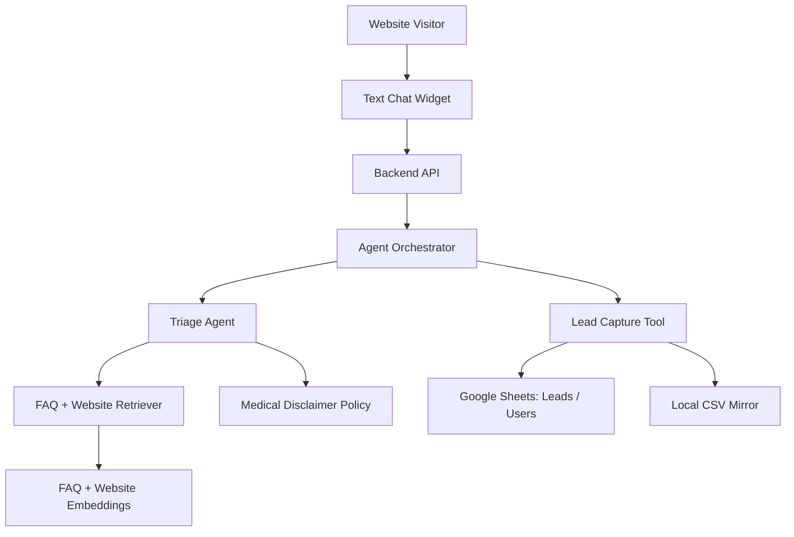

# Phase 1: Text-First Website Q&A + Lead Capture

## Business Goal
Launch the lowest-cost useful version of the doctor website assistant. The agent should answer common questions from approved website/FAQ knowledge and capture basic lead identity when the conversation becomes meaningful.

## Stakeholders
- Website visitor / potential patient
- Clinic owner
- Registration desk
- Implementation team

## Patient/User Experience
The user can ask questions in text, receive general clinic/service answers, and optionally share name and phone number for follow-up.

Example:

```text
User: IVF gurinchi details kavali
Agent: Gives general IVF information with disclaimer and asks whether the user wants appointment help.
```

## Medical Safety
The agent must include medical disclaimers for service and symptom-related answers.

Standard disclaimer:

```text
This is general information and not a medical diagnosis. Our doctor can guide you based on your medical history, reports, and test results.
```

## Scope
Included:

```text
website/FAQ embeddings
text chat widget
basic triage_agent
medical disclaimer
Level 1 identity: name, phone, preferred language
lead capture
Google Sheets + local CSV mirror
basic session ID
```

Not included:

```text
appointment CRUD
SMS automation
audio
video consultation
advanced memory bank
emergency escalation automation
```

## Tools
```text
Website chat widget
Embedding model
Vector index
FAQ/website retrieval tool
Google Sheets API
Local CSV mirror
Basic backend API
```

## Workflow
```text
User asks question
-> retrieve from FAQ/website embeddings
-> answer with disclaimer if medical/service related
-> if user shows interest, ask name + phone
-> create lead in Google Sheets
-> keep local CSV backup
```

## Architecture Visual


## Data And Artifacts
Creates:

```text
FAQ source file
website content source file
embedding index
Users sheet
Leads sheet
local users.csv
local leads.csv
```

## Economics
Cost control:

```text
text only
retrieval before generation
no Google Search unless needed later
Google Sheets instead of database
no audio/video cost
```

Business value:

```text
captures leads that would otherwise leave
reduces repeated basic calls
validates market need before deeper automation
```

## Risks
- FAQ/website content may be incomplete.
- Users may expect medical diagnosis.
- Lead capture timing must not feel pushy.

## Exit Criteria
```text
agent answers approved FAQ/service questions
lead capture works
Google Sheet and CSV mirror are created
medical disclaimer appears correctly
basic multilingual text behavior is acceptable
```
