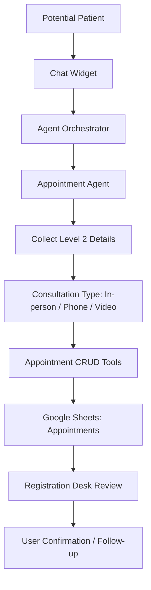

# Phase 2: Appointment Request Workflow

## Business Goal
Convert qualified leads into structured appointment requests for in-person, phone, or video consultation.

## Stakeholders
- Potential patient
- Registration desk
- Our doctor / concerned authority
- Clinic operations owner

## Patient/User Experience
The user can move from information-seeking to appointment request without leaving chat.

Example:

```text
User: I want to meet the doctor this week.
Agent: Collects Level 2 details and creates an appointment request for desk review.
```

## Medical Safety
The agent can collect appointment details but must not decide urgency, eligibility, treatment, or diagnosis.

## Scope
Included:

```text
Level 2 registration
appointment_agent
create appointment request
check appointment status
update appointment request
cancel appointment request
in-person / phone / video consultation type
Appointments Google Sheet
desk review workflow
```

Not included:

```text
automatic doctor calendar sync
guaranteed instant video link
payment collection
clinical triage
```

## Tools
```text
create_appointment
check_appointment_status
update_appointment
cancel_appointment
Google Sheets Appointments tab
appointment status lifecycle
desk notification placeholder
```

## Workflow
```text
User shows booking intent
-> confirm Level 1 identity
-> collect Level 2 details
-> create appointment request
-> write to Appointments sheet
-> desk reviews request
-> user gets confirmation message
```

## Architecture Visual


## Data And Artifacts
Creates or updates:

```text
Appointments sheet
appointments.csv
appointment_id
appointment status history
consultation type
desk notes
```

## Economics
Cost control:

```text
structured form-style collection reduces token usage
Google Sheets avoids database cost
video consultation is only a request until confirmed
```

Business value:

```text
turns website interest into booking pipeline
reduces manual back-and-forth
improves registration desk clarity
```

## Risks
- Users may think appointment is confirmed immediately.
- Desk must keep appointment statuses updated.
- Video consultation link generation may require external scheduling later.

## Exit Criteria
```text
appointment request can be created
appointment can be checked, updated, cancelled
registration desk has usable sheet view
user receives clear "request received" response
```
