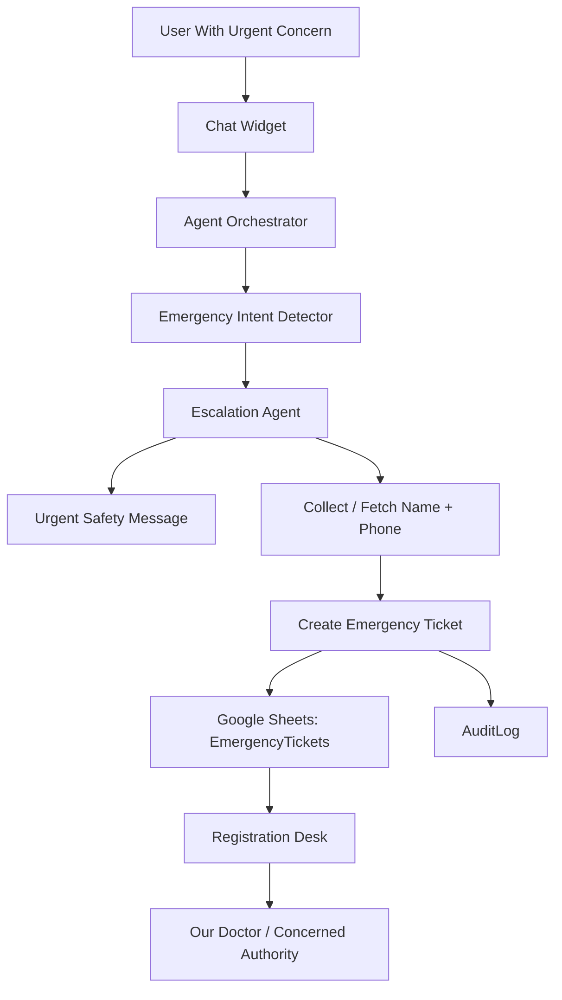

# Phase 3: Emergency Escalation + Human Handoff

## Business Goal
Handle urgent or severe user concerns safely by creating emergency tickets and routing them to humans.

## Stakeholders
- User / potential patient
- Registration desk
- Our doctor or concerned authority
- Clinic risk/safety owner

## Patient/User Experience
The user receives a clear safety message and is told that humans will be notified if contact details are available.

## Medical Safety
This phase is safety-critical. The agent must not diagnose, clinically triage, or delay urgent care.

Urgent response:

```text
If this is urgent or severe, please contact the clinic directly or seek emergency medical care. I can notify our registration desk, and you will receive a call from our doctor or the concerned authority.
```

## Scope
Included:

```text
urgent intent detection
emergency ticket creation
emergency disclaimer
human handoff workflow
EmergencyTickets sheet
AuditLog sheet
desk notification path
```

Not included:

```text
medical diagnosis
clinical severity scoring
emergency dispatch
automated treatment guidance
```

## Tools
```text
detect_emergency_intent
create_emergency_ticket
fetch_user_info
escalate_to_registration_desk
write_audit_log
SMS/WhatsApp/email notification placeholder or provider
```

## Workflow
```text
Urgent/severe language detected
-> show urgent disclaimer
-> collect name and phone if missing
-> create emergency ticket
-> notify registration desk
-> mark human follow-up required
-> log audit event
```

## Architecture Visual


## Data And Artifacts
Creates:

```text
EmergencyTickets sheet
emergency_tickets.csv
AuditLog record
human follow-up status
```

## Economics
Cost control:

```text
emergency detection should be lightweight
use structured ticket creation instead of long conversations
notify humans instead of keeping the model in unsafe loops
```

Business value:

```text
reduces operational and reputational risk
ensures high-concern users are not lost
creates human accountability
```

## Risks
- False positives may create unnecessary tickets.
- False negatives are safety risks.
- Notification failure must be visible.

## Exit Criteria
```text
urgent wording triggers safe response
emergency ticket is created
desk notification is recorded
audit log captures escalation
agent never gives diagnosis or treatment
```
