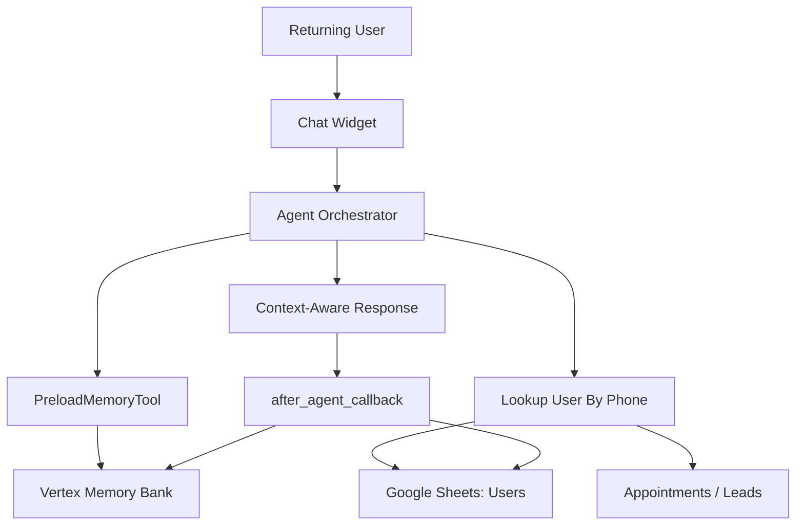

# Phase 4: Memory + Returning User Continuity

## Business Goal
Recognize returning users and improve continuity across sessions while preserving privacy and safety.

## Stakeholders
- Returning user / patient prospect
- Registration desk
- Clinic owner
- Implementation team

## Patient/User Experience
A returning user can provide name and phone number and continue without repeating everything.

Example:

```text
User: My name is Anjali, phone is 9XXXXXXXXX. I spoke two days ago.
Agent: Looks up the phone number, recalls preferred language and previous service interest, and continues carefully.
```

## Medical Safety
Memory should support continuity but must not become a clinical record or source of diagnosis.

## Scope
Included:

```text
phone-based user lookup
session continuity
VertexAiSessionService
VertexAiMemoryBankService
preferred language memory
past service interest memory
previous appointment status recall
```

Not included:

```text
full medical record storage
clinical report interpretation
automatic diagnosis from memory
```

## Tools
```text
PreloadMemoryTool
after_agent_callback
lookup_user_by_phone
lookup_leads_by_user
lookup_appointments_by_user
update_user_memory
```

## Workflow
```text
Returning user gives phone
-> look up Users sheet
-> load session/memory facts
-> retrieve open leads/appointments
-> continue conversation with context
-> update memory after conversation
```

## Architecture Visual


## Data And Artifacts
Creates or updates:

```text
Users sheet
preferred_language
preferred_script
last_seen_at
memory facts
session references
```

## Economics
Cost control:

```text
lookup structured data before asking the LLM
store summaries rather than full long chat context
load only relevant memory
```

Business value:

```text
better user experience
less repetition
stronger trust
higher conversion to appointment
```

## Risks
- Privacy mistakes if past details are revealed too freely.
- Memory may contain outdated facts.
- Phone number normalization must be consistent.

## Exit Criteria
```text
returning user can be found by phone
preferred language is remembered
open appointment/lead status can be retrieved
memory updates safely after conversation
```
