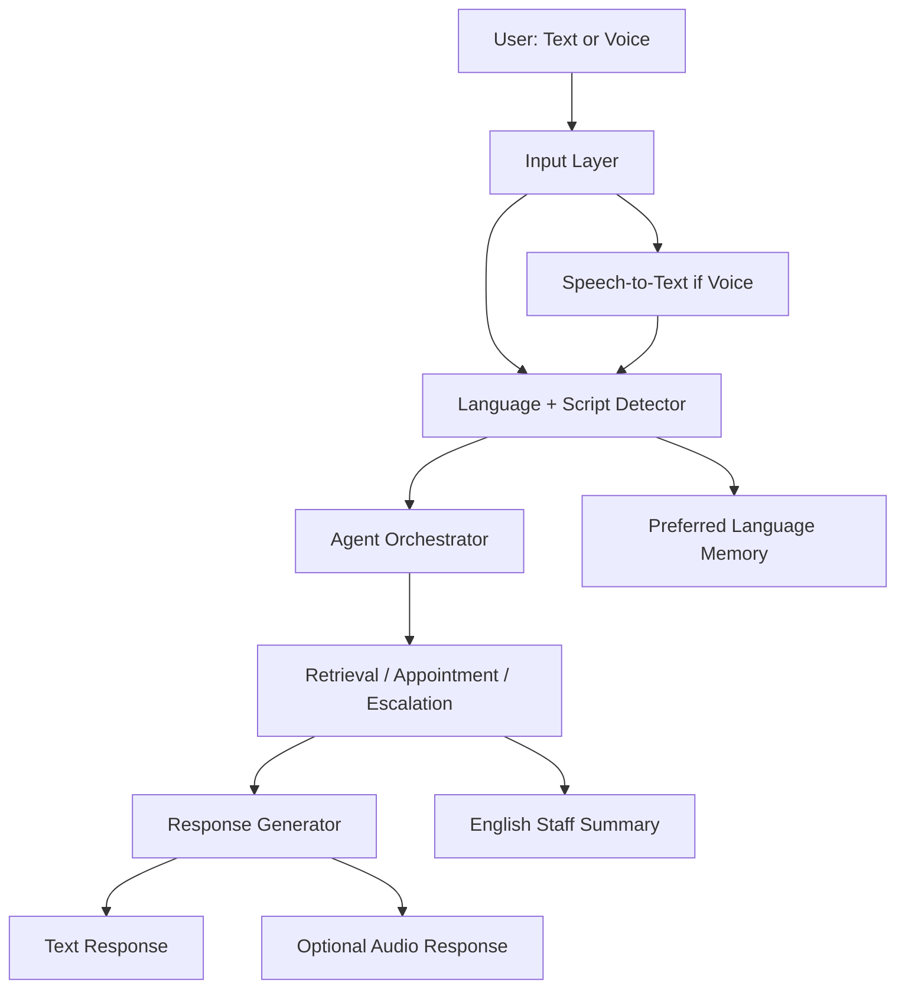

# Phase 5: Advanced Multilingual + Audio

## Business Goal
Make language access a real USP by supporting Indian languages, transliteration, optional voice input, and audio responses.

## Stakeholders
- Patients and families
- Clinic team
- Registration desk
- Marketing/business owner

## Patient/User Experience
Users can interact in English, Indian languages, or transliterated Indian languages typed in English letters.

Examples:

```text
ela unnaru -> Telugu transliteration
enakku appointment venum -> Tamil transliteration
mujhe IVF ke baare mein info chahiye -> Hindi transliteration
```

## Medical Safety
Disclaimers must be available in supported languages or safe transliterated form. Staff-facing summaries should remain in English.

## Scope
Included:

```text
stronger language detection
transliteration detection
same-language response
preferred language memory
voice input
optional audio response
language-specific SMS templates
staff-facing English summary
```

Not included:

```text
AI avatar video
fully automated video consultation platform
medical translation certification
```

## Tools
```text
language detector
transliteration detector
speech-to-text
text-to-speech
translation/transliteration helper
language template library
preferred_language memory
```

## Workflow
```text
User sends text or audio
-> detect language/script/transliteration
-> convert audio to text if needed
-> run retrieval/action flow
-> respond in user-preferred style
-> store language preference
-> write staff summary in English
```

## Architecture Visual


## Data And Artifacts
Creates or updates:

```text
preferred_language
preferred_script
language templates
disclaimer templates
SMS templates
staff summary field
```

## Economics
Cost control:

```text
text remains default
audio only when user taps microphone/speaker
store transcripts, not raw audio by default
use cached templates for standard messages
```

Business value:

```text
larger patient reach
better accessibility
strong market differentiation
more trust for regional-language users
```

## Risks
- Language detection errors.
- Medical nuance may be lost in translation.
- Audio increases cost.

## Exit Criteria
```text
supported language list works acceptably
transliterated Telugu/Tamil/Hindi examples work
audio input produces usable text
audio response is optional
staff summary remains English
```
