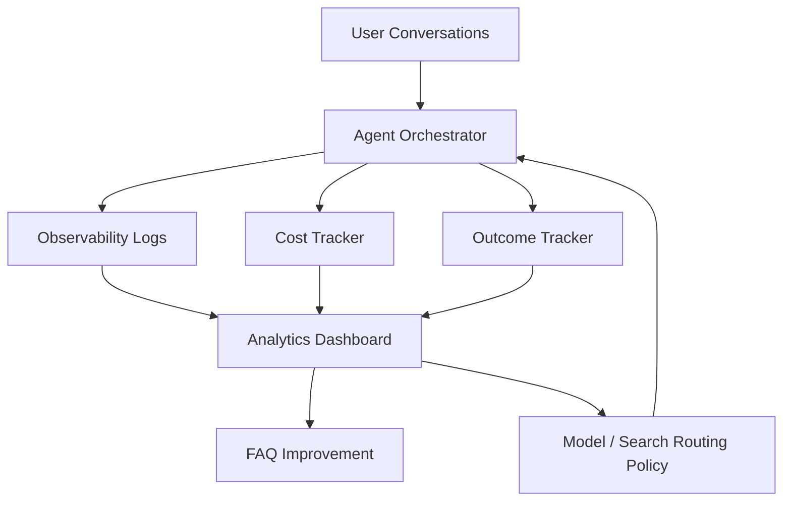

# Phase 6: Automation + Analytics + Cost Governance

## Business Goal
Make the system measurable, governable, and economically controlled.

## Stakeholders
- Clinic owner
- Registration desk manager
- Product/implementation team
- Finance/business decision-maker

## Patient/User Experience
The user experience should stay simple. Analytics and cost governance happen behind the scenes.

## Medical Safety
Analytics should track handoffs and unsafe-intent patterns without exposing unnecessary personal or medical details.

## Scope
Included:

```text
lead analytics
appointment funnel analytics
FAQ performance tracking
Google Search fallback tracking
language usage reports
emergency escalation reports
cost per conversation
cost per lead
cost per appointment request
model routing policy
budget controls
dashboard/reporting
```

Not included:

```text
clinical outcome analytics
medical diagnosis analytics
complex BI warehouse
```

## Tools
```text
observability logs
cost ledger
model routing rules
analytics dashboard
Google Sheets summary tabs
FAQ quality reports
budget thresholds
```

## Workflow
```text
Every request gets request_id/session_id
-> log retrieval/search/model/tool usage
-> classify outcome: answer, lead, appointment, emergency
-> compute costs
-> update dashboard/report
-> tune FAQ and routing policy
```

## Architecture Visual


## Data And Artifacts
Creates:

```text
cost logs
conversation outcome logs
lead funnel report
appointment funnel report
FAQ performance report
fallback rate report
language distribution report
```

## Economics
Cost control:

```text
track model usage
track search fallback usage
prefer cheaper model for simple turns
avoid expensive model for greetings and CRUD lookups
optimize FAQ content to reduce fallback cost
```

Business value:

```text
shows ROI
reveals what users ask most
improves clinic operations
controls AI spend
```

## Risks
- Over-logging sensitive information.
- Dashboard complexity may distract from operations.
- Cost estimates may need calibration.

## Exit Criteria
```text
cost per lead is visible
cost per appointment request is visible
FAQ fallback rate is visible
language distribution is visible
emergency handoff count is visible
```
