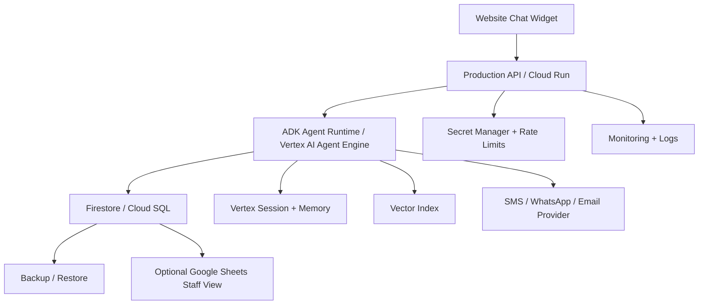

# Phase 7: Production Hardening + Future Database

## Business Goal
Prepare the system for reliable production deployment, scale, security, and future migration beyond Google Sheets.

## Stakeholders
- Clinic owner
- Registration desk
- Technical operations team
- Security/privacy owner

## Patient/User Experience
The user should experience faster, more reliable chat, fewer failures, and safer handling of personal data.

## Medical Safety
Production hardening must preserve disclaimer behavior, emergency escalation, audit logs, and human handoff traceability.

## Scope
Included:

```text
Firestore or Cloud SQL migration option
role-based access
secret management
production deployment
CI/CD
rate limiting
monitoring
backup and restore
privacy policy alignment
error handling
test suite
```

Not included:

```text
full hospital information system replacement
clinical EMR integration unless separately approved
payment processing unless separately approved
```

## Tools
```text
Firestore or Cloud SQL
Google Secret Manager
Cloud Run or Vertex AI Agent Engine
CI/CD pipeline
monitoring/logging
backup scripts
test suite
access control
```

## Workflow
```text
Move from prototype operations to production runtime
-> secure secrets
-> add tests
-> deploy with monitoring
-> define backup/restore
-> optionally migrate sheets to database
-> keep Sheets as staff interface if useful
```

## Architecture Visual


## Data And Artifacts
Creates:

```text
production environment config
deployment scripts
test suite
monitoring dashboards
backup plan
database schema
access policy
incident runbook
```

## Economics
Cost control:

```text
database only when Google Sheets becomes limiting
autoscaling deployment
budget alerts
model routing
cached retrieval
observability-driven optimization
```

Business value:

```text
reliable clinic-facing production system
scalable beyond manual sheets
lower operational risk
future-ready architecture
```

## Risks
- More infrastructure means more maintenance.
- Privacy/security obligations increase.
- Database migration must not disrupt clinic operations.

## Exit Criteria
```text
production deployment is monitored
secrets are not stored in code
rate limits are active
backup and restore are tested
critical workflows have tests
Google Sheets to database path is clear
```
