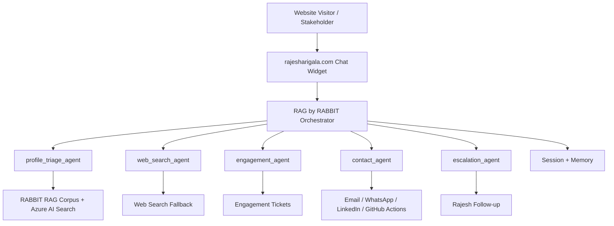

# System Architecture

## Purpose
This document maps the shared multi-agent architecture to RAG by RABBIT.

## High-Level Architecture
```text
User
-> RAG by RABBIT Orchestrator
   -> profile_triage_agent
   -> web_search_agent
   -> engagement_agent
   -> contact_agent
   -> escalation_agent
-> session/memory layer
-> engagement/opportunity storage
-> notification/contact layer
```

## Architecture Visual


## Why This Architecture
It separates answering, external grounding, opportunity qualification, contact actions, and high-value escalation. This lets the system remain professional, evidence-based, and action-oriented.
