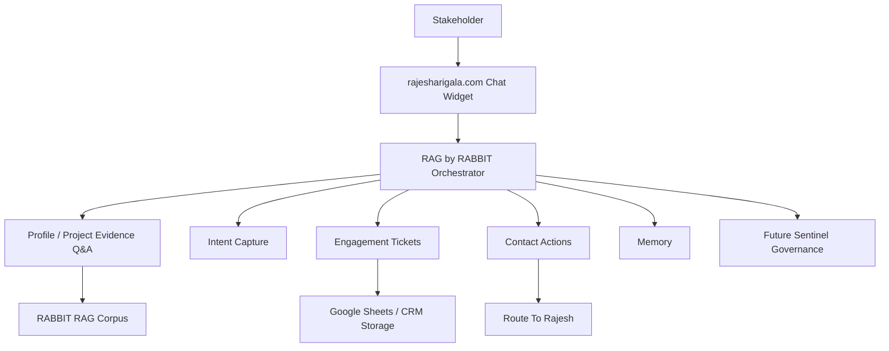

# Usecase 2 Phase Roadmap

## Purpose
This folder documents the phased build plan for RAG by RABBIT, the action-oriented opportunity agent for `rajesharigala.com`.

## Approved Phase Structure
```text
Phase 1: Stabilize RABBIT Assistant As Evidence Q&A
Phase 2: Stakeholder Identity + Intent Capture
Phase 3: Engagement Ticket Workflow
Phase 4: Contact + Action Tools
Phase 5: Memory + Returning Stakeholder Continuity
Phase 6: Analytics + Opportunity Economics
Phase 7: Sentinel Governance + Production Hardening
```

## Overall Architecture


## Phase Philosophy
Use the existing RABBIT Assistant as the knowledge foundation, then add action capabilities in a controlled way:

```text
evidence -> intent -> ticket -> contact -> memory -> economics -> governance
```
