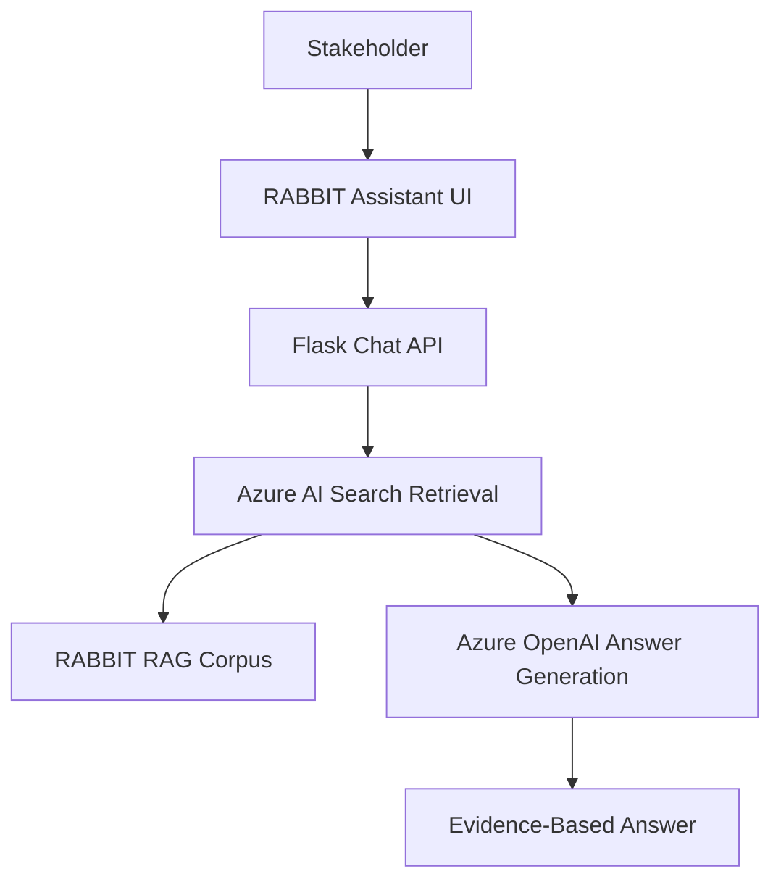

# Phase 1: Stabilize RABBIT Assistant As Evidence Q&A

## Business Goal
Make the existing RABBIT Assistant stable, credible, and recruiter/stakeholder friendly as the evidence-answering foundation.

## Stakeholders
- Recruiters
- Hiring managers
- Consultants
- Potential clients
- Rajesh

## User Experience
The visitor asks about Rajesh's profile, projects, business background, AI/MLOps work, or role fit and receives a concise answer grounded in website evidence.

## Scope
Included:

```text
existing RABBIT RAG corpus
Azure AI Search retrieval
Azure OpenAI answer generation
profile/project evidence answers
professional boundaries
proof-of-work explanation
```

Not included:

```text
engagement ticket creation
contact automation
CRM/storage actions
Sentinel governance
```

## Tools
```text
RABBIT Flask app
Azure AI Search
Azure OpenAI embeddings
Azure OpenAI chat model
answer prompt template
retrieval test cases
```

## Workflow
```text
User asks professional question
-> retrieve from RABBIT corpus
-> generate answer
-> show relevant links
-> maintain professional boundary
```

## Architecture Visual


## Economics
Cost is tied to retrieval, embeddings for queries, and answer generation. Keep answers concise and retrieval top-k controlled.

## Exit Criteria
```text
public Q&A works
answers stay evidence-based
proof-of-work positioning is clear
privacy and professional boundaries work
```
