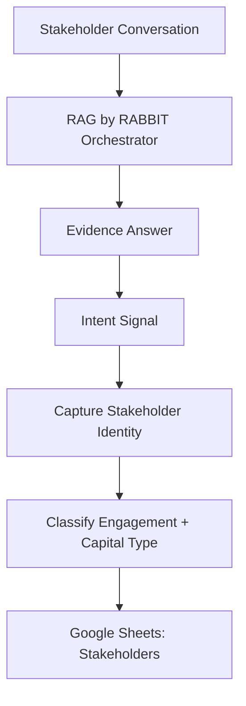

# Phase 2: Stakeholder Identity + Intent Capture

## Business Goal
Identify serious stakeholders and classify their intent without forcing registration too early.

## Stakeholders
- Recruiters
- Clients
- Event organizers
- Collaborators
- Investors/capital contacts

## User Experience
The agent answers first. When intent becomes meaningful, it asks for lightweight professional details.

## Scope
Included:

```text
name capture
organization capture
role capture
contact channel capture
engagement type classification
money/social capital classification
national/international flag
```

## Tools
```text
classify_engagement_type
classify_capital_type
capture_stakeholder_identity
Stakeholders sheet
```

## Workflow
```text
User shows professional intent
-> agent asks for name/organization/role/contact
-> classify engagement type
-> classify money/social capital
-> store stakeholder record
```

## Architecture Visual


## Economics
Structured capture reduces long model conversations. Google Sheets avoids CRM/database cost at launch.

## Exit Criteria
```text
stakeholder details can be captured
intent can be classified
money/social capital is recorded
national/international scope is recorded
```
