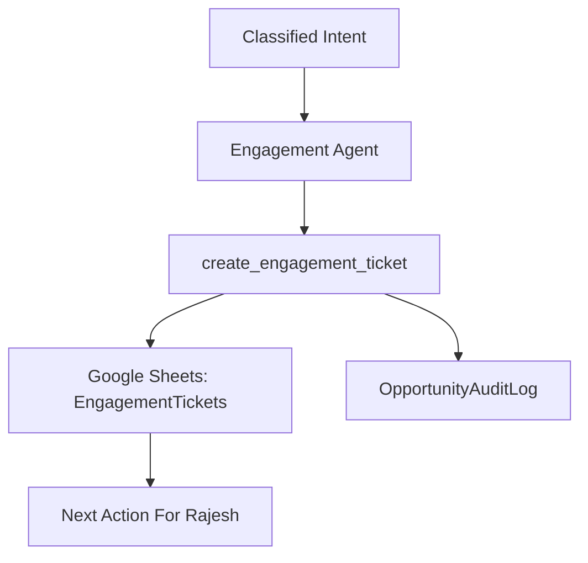

# Phase 3: Engagement Ticket Workflow

## Business Goal
Convert serious professional intent into structured opportunity records.

## Stakeholders
- Rajesh
- Recruiters
- Clients
- Event organizers
- Collaborators

## User Experience
The user can express an opportunity, and the agent creates an engagement ticket for Rajesh to review.

## Scope
Included:

```text
create engagement ticket
check engagement status
update engagement ticket
close engagement ticket
priority field
next action field
OpportunityAuditLog
```

## Tools
```text
create_engagement_ticket
check_engagement_status
update_engagement_ticket
close_engagement_ticket
escalate_engagement_to_rajesh
```

## Workflow
```text
Intent captured
-> create engagement ticket
-> write ticket to sheet
-> log audit event
-> tell user Rajesh can follow up
```

## Architecture Visual


## Economics
Engagement tickets are the conversion asset. Track cost per qualified opportunity and avoid expensive model calls for simple CRUD actions.

## Exit Criteria
```text
engagement ticket lifecycle works
priority and next action are stored
audit log records creation and updates
```
