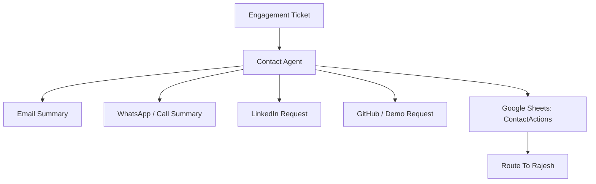

# Phase 4: Contact + Action Tools

## Business Goal
Turn opportunity records into practical next-step actions.

## Stakeholders
- Rajesh
- Stakeholder submitting opportunity
- Professional contact channels

## User Experience
The user can request a call, email follow-up, LinkedIn connection, GitHub/demo link, or meeting discussion.

## Scope
Included:

```text
prepare email summary
prepare WhatsApp/call summary
capture LinkedIn request
capture GitHub/project demo request
meeting/demo request workflow
contact action tracking
```

## Tools
```text
prepare_email_summary
prepare_whatsapp_message
capture_linkedin_request
capture_github_demo_request
create_contact_action
```

## Workflow
```text
Engagement ticket exists
-> user chooses contact path
-> agent prepares summary
-> contact action is recorded
-> Rajesh receives structured context
```

## Architecture Visual


## Economics
Contact tools increase conversion without heavy model cost if summaries are structured and template-driven.

## Exit Criteria
```text
contact actions can be recorded
summaries are useful to Rajesh
no false live-availability promises
```
