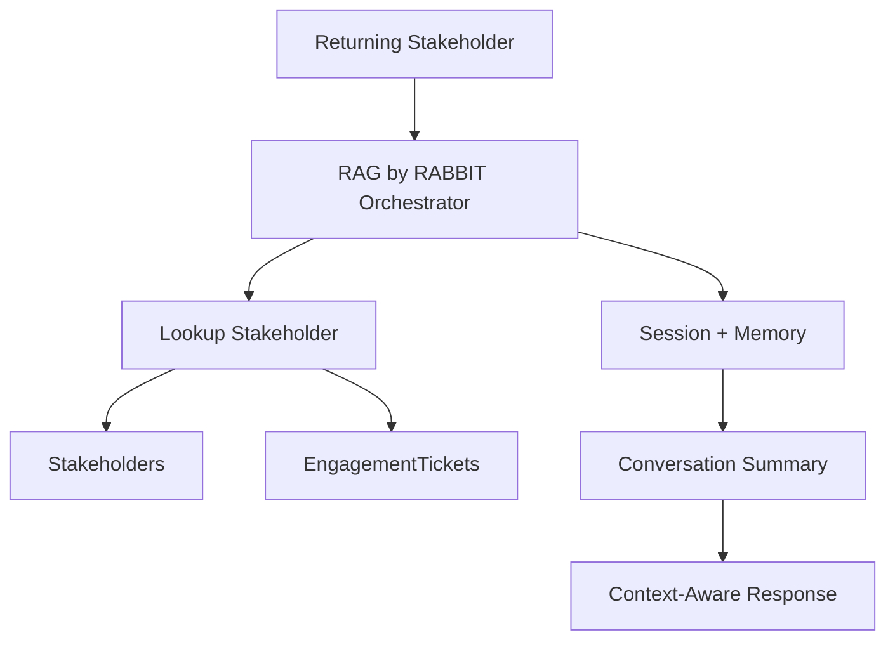

# Phase 5: Memory + Returning Stakeholder Continuity

## Business Goal
Recognize returning stakeholders and maintain continuity across opportunity conversations.

## Stakeholders
- Returning recruiters/clients/collaborators
- Rajesh
- Implementation team

## User Experience
A returning stakeholder can continue from a previous conversation without repeating their organization, role, and opportunity context.

## Scope
Included:

```text
session continuity
returning stakeholder lookup
conversation summaries
preferred contact channel memory
prior engagement recall
```

## Tools
```text
lookup_stakeholder
lookup_engagements
update_conversation_summary
PreloadMemoryTool
after_agent_callback
```

## Workflow
```text
Returning stakeholder provides email/phone/name
-> lookup stakeholder
-> retrieve prior engagement tickets
-> load summary
-> continue conversation
```

## Architecture Visual


## Economics
Memory reduces repeated context collection and improves lead quality. Store summaries rather than long raw conversations.

## Exit Criteria
```text
returning stakeholder lookup works
prior engagements can be recalled
summary supports follow-up questions
privacy boundaries remain intact
```
