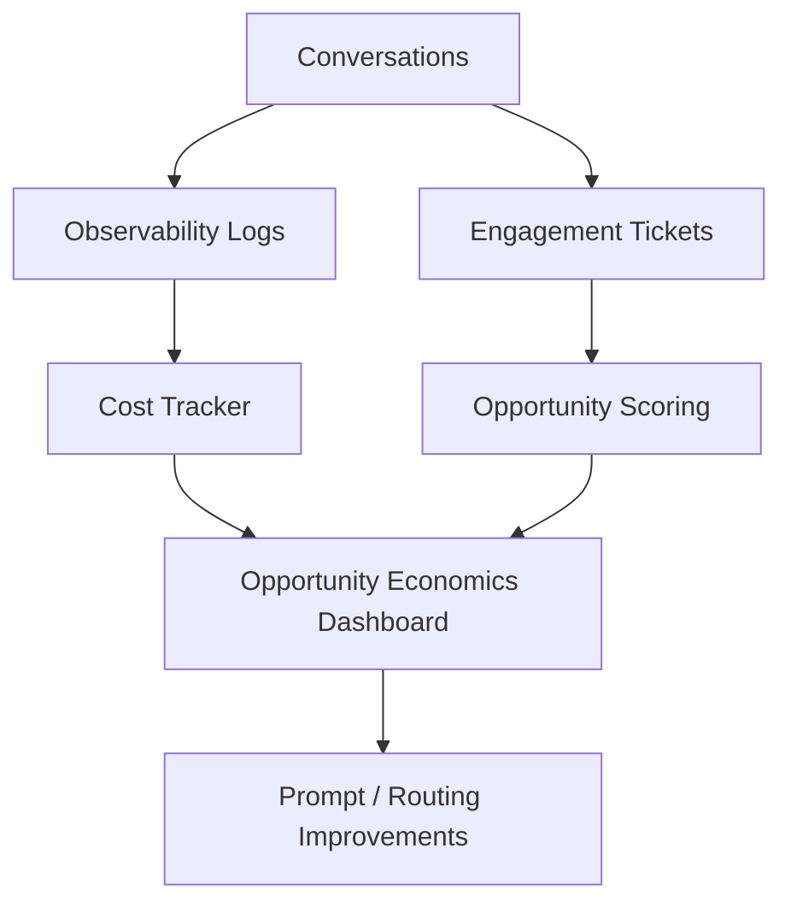

# Phase 6: Analytics + Opportunity Economics

## Business Goal
Measure whether RAG by RABBIT creates money-capital and social-capital value.

## Stakeholders
- Rajesh
- Product/business owner
- Future stakeholders evaluating the system

## Scope
Included:

```text
opportunity analytics
cost per qualified opportunity
money-capital vs social-capital reporting
national vs international reporting
priority scoring
conversion dashboard
retrieval and model cost tracking
```

## Tools
```text
cost tracker
opportunity dashboard
priority scoring
analytics sheet
observability logs
```

## Workflow
```text
Conversation occurs
-> outcome is classified
-> opportunity/cost metrics are logged
-> dashboard summarizes value
-> routing and prompts are improved
```

## Architecture Visual


## Economics
Track:

```text
cost per conversation
cost per qualified opportunity
cost per money-capital lead
cost per social-capital lead
high-value opportunity count
conversion rate
```

## Exit Criteria
```text
dashboard shows opportunity volume
money/social capital split is visible
cost per opportunity is visible
top stakeholder intents are visible
```
