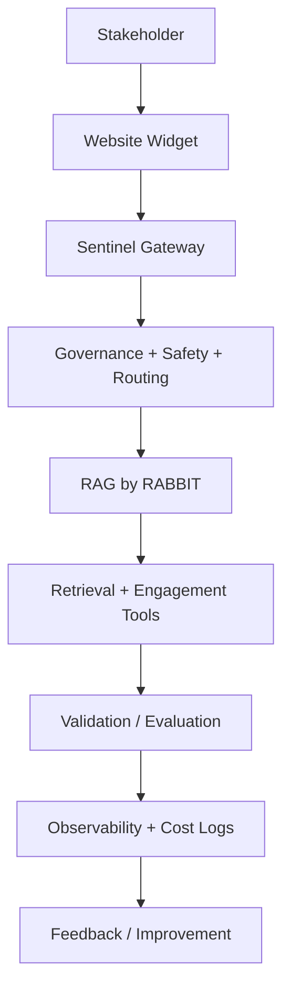

# Phase 7: Sentinel Governance + Production Hardening

## Business Goal
Prepare RAG by RABBIT for governed, cost-aware, production-grade operation and future integration with Sentinel Gateway.

## Stakeholders
- Rajesh
- Technical operators
- Enterprise evaluators
- Future clients

## Scope
Included:

```text
production deployment
secret management
rate limiting
monitoring
model routing
cost governance
validation/evaluation path
Sentinel Gateway connection
backup/restore
tests
```

## Tools
```text
Sentinel Gateway
Secret Manager
monitoring/logging
model routing policy
cost ledger
test suite
CI/CD
```

## Workflow
```text
User request
-> Sentinel-style governance/routing
-> RAG by RABBIT execution
-> validation/evaluation
-> observability/cost logging
-> continuous improvement
```

## Architecture Visual


## Economics
Sentinel should reduce waste by routing simple requests cheaply, governing tool use, tracking cost, and preventing premium-model overuse.

## Exit Criteria
```text
production deployment is stable
secrets are protected
cost/routing policy exists
critical workflows are tested
Sentinel integration path is documented
```
